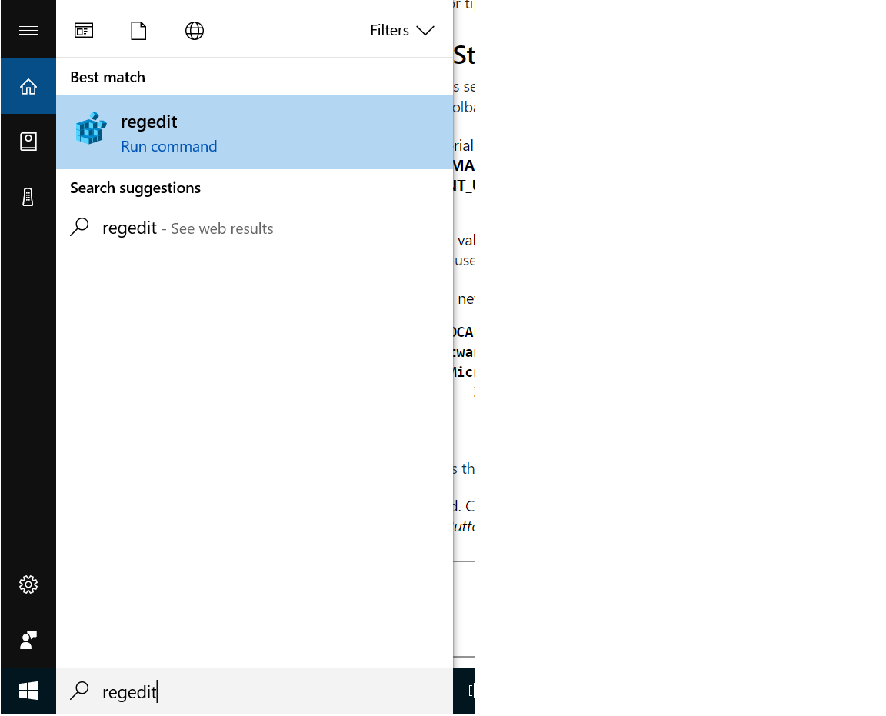
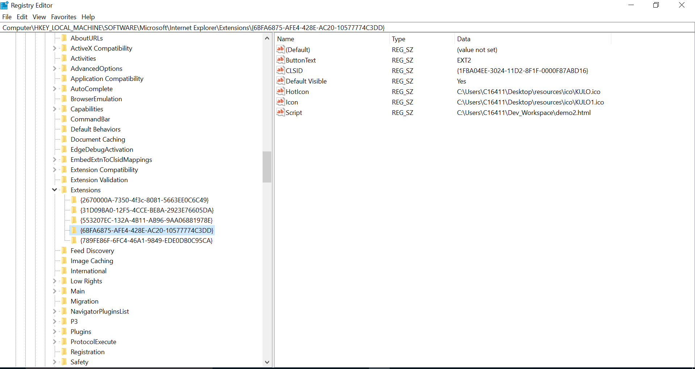

# IE-AddOns : BingSearch
---
A custom IE11 addon to open a new tab with bing Search.

Steps to install addons :
---
Create a valid GUID.
You can use Guidgen.exe from Microsoft Visual Studio, or Uuidgen.exe from the Windows Software Development Kit (SDK).

Open registry.

Create a new key (using the GUID as the name) in the registry under:
HKEY_LOCAL_MACHINE
   Software
      Microsoft
         Internet Explorer
            Extensions
               {GUID}

{GUID} is the valid GUID that you created in step 1.
Required. Create the following string values in the registry under the new key:
ButtonText - Set the value to the label you want for the toolbar button.

`HKEY_LOCAL_MACHINE\Software\Microsoft\Internet Explorer\Extensions\{GUID}\ButtonText`

HotIcon - Set the full path of the .ico file that contains the three color icons.

`HKEY_LOCAL_MACHINE\Software\Microsoft\Internet Explorer\Extensions\{GUID}\HotIcon`

Icon - Set the full path of the .ico file that contains the three grayscale icons.

`HKEY_LOCAL_MACHINE\Software\Microsoft\Internet Explorer\Extensions\{GUID}\Icon`

Optional. The following values determine if the icon is initially visible.
Default Visible - To make the toolbar button to appear on the Internet Explorer toolbar by default, set Default Visible to "Yes", otherwise set Default Visible to "No".

`HKEY_LOCAL_MACHINE\Software\Microsoft\Internet Explorer\Extensions\{GUID}\Default Visible`

## Adding the Details
To complete the setup of the custom command, you must provide details of the action that takes place when the button is clicked.To do that, add the script to be run.

Scripts
The following steps are required to complete the creation of a toolbar button that runs a script.
Create a new string value, CLSID, in the registry as follows:

`HKEY_LOCAL_MACHINE\Software\Microsoft\Internet Explorer\Extensions\{GUID}\CLSID`

Set the value of CLSID equal to {1FBA04EE-3024-11D2-8F1F-0000F87ABD16} to specify the CLSID_Shell_ToolbarExtExec extension class.
Create a new string value, Script, in the registry as follows:

`HKEY_LOCAL_MACHINE\Software\Microsoft\Internet Explorer\Extensions\{GUID}\Script`

Set the value of Script to the full path of the script to run.
 
